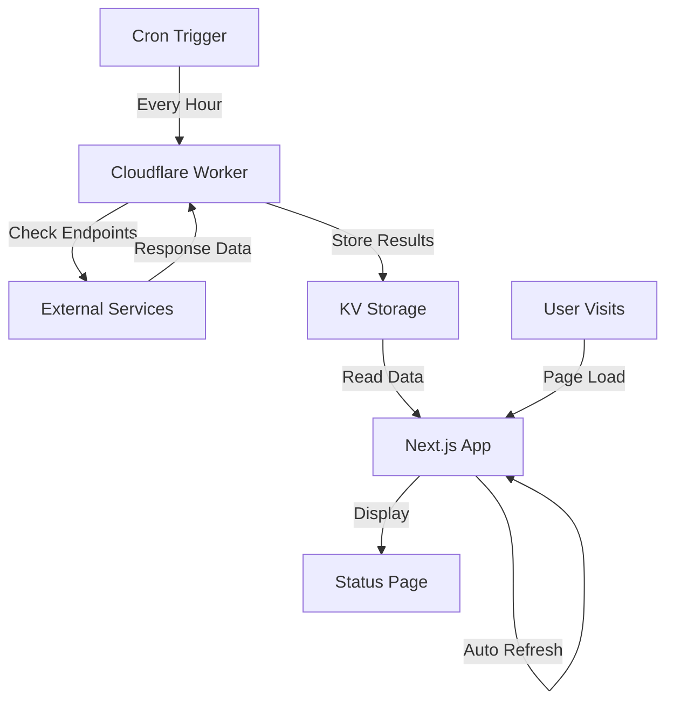

# How Uptimeflare Works - Detailed Architecture Guide

## 🏗️ System Overview

Uptimeflare is a distributed uptime monitoring system built on Cloudflare's edge infrastructure. It consists of three main components that work together to provide real-time monitoring and status reporting.

## 🔄 Architecture Components

### 1. Cloudflare Worker (Monitoring Engine)
- **Location**: `/worker/` directory
- **Runtime**: Cloudflare Workers (V8 isolates)
- **Purpose**: Performs uptime checks and stores results

### 2. Next.js Application (Status Dashboard)
- **Location**: Root directory
- **Runtime**: Cloudflare Pages (static + edge functions)
- **Purpose**: Displays monitoring data in a web interface

### 3. Cloudflare KV Storage (Data Layer)
- **Namespace**: `uptimeflare_kv`
- **Purpose**: Stores monitoring state and historical data

## 📊 Data Flow Architecture



## 🕒 Monitoring Process

### Step 1: Cron Execution
```javascript
// Triggered every hour by Cloudflare Cron
scheduled(event: ScheduledEvent, env: Env, ctx: ExecutionContext)
```

### Step 2: Service Checks
The worker performs HTTP requests to configured endpoints:
```typescript
// From uptime.config.ts
monitors: [
  {
    id: 'portfolio_site',
    name: 'Portfolio Site',
    target: 'https://srikanthkarthi.tech',
    method: 'GET'
  }
  // ... more monitors
]
```

### Step 3: Data Collection
For each service, the worker collects:
- ✅ **Status**: Up/Down (HTTP 200 = Up)
- ⏱️ **Response Time**: Latency in milliseconds
- 📍 **Location**: Monitoring location (e.g., SLC)
- 🕐 **Timestamp**: When the check occurred
- ❌ **Errors**: Any error messages or failure reasons

### Step 4: Data Storage
Results are stored in KV as JSON:
```json
{
  "version": 1,
  "lastUpdate": 1757588413,
  "overallUp": 5,
  "overallDown": 0,
  "incident": {
    "service_id": [{
      "start": [timestamp],
      "end": timestamp,
      "error": ["error_message"]
    }]
  },
  "latency": {
    "service_id": {
      "recent": [{"loc": "SLC", "ping": 661, "time": 1757588414}],
      "all": []
    }
  }
}
```

## 🌐 Status Page Operation

### Server-Side Rendering
```typescript
// pages/index.tsx - getServerSideProps()
export async function getServerSideProps() {
  const { UPTIMEFLARE_STATE } = process.env as unknown as {
    UPTIMEFLARE_STATE: KVNamespace
  }
  
  // Read current state from KV
  const state = await UPTIMEFLARE_STATE?.get('state')
  return { props: { state, monitors } }
}
```

### Real-Time Updates
The status page implements auto-refresh:
```typescript
// OverallStatus.tsx
useEffect(() => {
  const interval = setInterval(() => {
    // If data is older than 5 minutes, reload page
    if (currentTime - state.lastUpdate > 300 && currentTime - openTime > 30) {
      window.location.reload()
    }
    setCurrentTime(Math.round(Date.now() / 1000))
  }, 1000)
}, [])
```

## ⚡ Key Features

### 1. Edge-First Architecture
- **Global Distribution**: Runs on Cloudflare's edge network
- **Low Latency**: Monitoring from multiple geographic locations
- **High Availability**: Built-in redundancy and failover

### 2. Real-Time Status Updates
- **Auto-Refresh**: Page reloads when data becomes stale
- **Live Timestamps**: Shows "X seconds ago" with real-time updates
- **Instant Visibility**: New monitoring data appears immediately

### 3. Incident Tracking
- **Downtime Detection**: Tracks when services go down/up
- **Historical Data**: Maintains incident history
- **Error Logging**: Records specific error messages

### 4. Performance Monitoring
- **Latency Tracking**: Measures response times
- **Location-Based**: Shows performance from different regions
- **Trend Analysis**: Historical performance data

## 🔧 Configuration

### Monitor Configuration (`uptime.config.ts`)
```typescript
export const workerConfig = {
  monitors: [
    {
      id: 'unique_id',
      name: 'Display Name',
      target: 'https://example.com',
      method: 'GET',
      expectedCodes: [200],
      timeout: 10000
    }
  ]
}
```

### Page Configuration
```typescript
export const pageConfig = {
  title: 'System Status',
  links: [
    { label: 'Github', link: 'https://github.com/...' },
    { label: 'LinkedIn', link: 'https://linkedin.com/...' }
  ]
}
```

## 🚀 Deployment Architecture

### Infrastructure as Code (Terraform)
```hcl
# deploy.tf
resource "cloudflare_workers_kv_namespace" "uptimeflare_kv" {
  account_id = var.CLOUDFLARE_ACCOUNT_ID
  title      = "uptimeflare_kv"
}

resource "cloudflare_workers_script" "uptimeflare" {
  name    = "uptimeflare_worker"
  content = file("worker/dist/index.js")
  
  kv_namespace_binding {
    name         = "UPTIMEFLARE_STATE"
    namespace_id = cloudflare_workers_kv_namespace.uptimeflare_kv.id
  }
}

resource "cloudflare_workers_cron_trigger" "uptimeflare_worker_cron" {
  script_name = cloudflare_workers_script.uptimeflare.name
  schedules   = ["0 */1 * * *"] # Every hour
}
```

### GitHub Actions Pipeline
```yaml
# .github/workflows/deploy.yml
on:
  push:
    branches: ['main']

jobs:
  build:
    steps:
      - name: Build worker
        run: npx wrangler deploy --dry-run
      
      - name: Build pages
        run: npx @cloudflare/next-on-pages
      
      - name: Deploy with Terraform
        run: terraform apply
```

## 🔄 Data Persistence

### KV Storage Structure
- **Key**: `'state'`
- **Value**: JSON monitoring data
- **TTL**: No expiration (persistent)
- **Global**: Replicated across Cloudflare's network

### Data Updates
1. **Worker writes** new monitoring results every hour
2. **Pages reads** current state on each page load
3. **Auto-refresh** ensures users see latest data
4. **Historical data** maintained for incident tracking

## 🛠️ Development Workflow

### Local Development
```bash
# Run development server
npm run dev

# Test worker locally  
cd worker && npx wrangler dev

# Deploy to staging
terraform plan
terraform apply
```

### Production Deployment
- **Automated**: Triggered by push to `main` branch
- **Build Process**: Worker + Pages built in parallel
- **Infrastructure**: Terraform manages all Cloudflare resources
- **Rollback**: Git-based rollback with Terraform state

## 📈 Monitoring Metrics

### System Health Indicators
- **Overall Status**: Up/Down count across all services
- **Response Times**: Latency measurements per service
- **Uptime Percentage**: Historical availability metrics
- **Incident Duration**: Time-to-recovery tracking

### Geographic Distribution
- **Multi-Region**: Monitoring from Cloudflare edge locations
- **Location Codes**: SLC (Salt Lake City), etc.
- **Regional Performance**: Latency varies by geographic location

## 🔐 Security & Reliability

### Access Control
- **API Tokens**: Cloudflare API tokens for deployment
- **Environment Variables**: Sensitive data in GitHub Secrets
- **KV Permissions**: Worker-only write access to monitoring data

### Error Handling
- **Graceful Degradation**: Shows last known status if monitoring fails
- **Timeout Protection**: Prevents hanging requests
- **Retry Logic**: Built-in retry for transient failures

## 🎯 Performance Characteristics

### Monitoring Frequency
- **Cron Schedule**: Every hour (`0 */1 * * *`)
- **Check Duration**: ~1-5 seconds per service
- **Data Freshness**: Maximum 1 hour staleness

### Page Performance
- **Static Generation**: Pre-rendered at build time
- **Edge Caching**: Served from Cloudflare's CDN
- **Auto-Refresh**: Client-side polling for updates

This architecture provides a robust, scalable, and cost-effective uptime monitoring solution using Cloudflare's serverless platform.